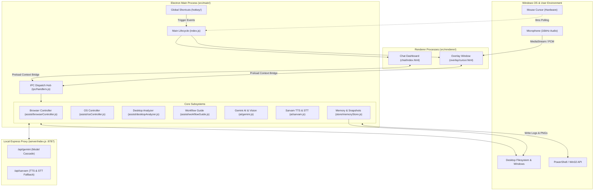

# Pointly — Ambient AI Desktop Companion & Screen-Aware Co-pilot

<div align="center">


**A screen-aware, ambient AI co-pilot built with Electron & Node.js for Windows.**  
*Push-to-talk voice commands, real-time desktop vision, guided multi-step application workflows, Chrome browser automation, and native OS controls — all living as an ultra-compact 26px companion beside your cursor.*

[Architecture](#-system-architecture) • [Key Features](#-key-features) • [Shortcuts](#-shortcuts--controls) • [Installation](#-getting-started) • [Configuration](#-environment-configuration) • [Project Structure](#-project-structure)

</div>

---

## 🌟 Overview

**Pointly** re-imagines desktop human-computer interaction by replacing bulky AI chat windows with an **ambient, screen-aware cursor companion**. Pointly floats silently right beside your mouse pointer as a 26px Dark Red buddy (`#800a1e`) with **100% click pass-through**, meaning it never intercepts or blocks your normal operating system workflow.

When activated via push-to-talk (`Ctrl + Space`) or micro text typing (`Ctrl + T`), Pointly analyzes your screen, understands natural voice or text commands, speaks back with lifelike Indic and English voices via **Sarvam AI**, reasons using **Google Gemini Multimodal AI**, glides its glowing spotlight beacon across desktop coordinates, and guides you through complex workflows step-by-step.

```
                  ┌────────────────────────────────────────┐
                  │          POINTLY ARCHITECTURE          │
                  └───────────────────┬────────────────────┘
                                      │
         ┌────────────────────────────┼────────────────────────────┐
         │                            │                            │
         ▼                            ▼                            ▼
┌──────────────────┐        ┌──────────────────┐        ┌──────────────────┐
│  Cursor Overlay  │        │  Main Controller │        │  Chat Dashboard  │
│  • 120Hz Tracking│◄──────►│  • IPC Routing   │◄──────►│  • Voice Panel   │
│  • Bouncy Physics│        │  • Assist Engine │        │  • Settings      │
│  • Beacon Ring   │        │  • Global Hotkeys│        │  • History       │
└──────────────────┘        └─────────┬────────┘        └──────────────────┘
                                      │
         ┌────────────────────────────┼────────────────────────────┐
         │                            │                            │
         ▼                            ▼                            ▼
┌──────────────────┐        ┌──────────────────┐        ┌──────────────────┐
│   AI & Vision    │        │  Native Assist   │        │ Backend & Store  │
│  • Gemini Vision │        │  • PowerShell/OS │        │  • Express Proxy │
│  • Sarvam STT/TTS│        │  • Chrome Engine │        │  • Memory & Snap │
│  • Model Cascade │        │  • Desktop Scan  │        │  • Clipboard IPC │
└──────────────────┘        └──────────────────┘        └──────────────────┘
```

---

## 🏗️ System Architecture

Pointly is engineered with a modular, multi-process architecture adhering to Electron security best practices (isolated renderers, preload context bridges, non-blocking asynchronous IPC, and proxy API abstraction).



### 1. Electron Main Process (`src/main/`)
- **Lifecycle & Window Management (`index.js`)**: Coordinates transparent overlay creation across multi-monitor setups, frameless chat dashboard initialization, audio/media permission grants, and global hotkeys.
- **IPC Dispatch Center (`ipc/handlers.js`)**: Routes renderer invocations to AI reasoning, screen capture, speech processing, browser controls, OS commands, and memory persistence.
- **Hardware Cursor Tracking (`windows/cursorOverlay.js`)**: High-frequency (~120Hz / 8ms interval) polling of native screen cursor coordinates (`screen.getCursorScreenPoint()`), streaming coordinates to the transparent overlay with mouse event pass-through (`setIgnoreMouseEvents(true, { forward: true })`).
- **Global Hotkey Daemon (`hotkey/globalShortcut.js`)**: Registers OS-wide shortcut handlers with dynamic environment variable overrides.

### 2. Multi-Window Renderer Layer (`src/renderer/`)
- **Transparent Screen Overlay (`overlay/`)**:
  - **Clicky-Style Companion**: Ultra-compact 26px dark red orb (`#800a1e`) with dynamic animated blinking/tracking eyes and state auras.
  - **Inertia Physics & Motion Smoothing**: GPU-accelerated requestAnimationFrame render loop with velocity damping, dynamic movement tilt (-14° to +14°), and automatic viewport edge flipping.
  - **Spotlight Beacon Ring**: Multi-layered animated beacon ring that projects and highlights target buttons or files on the screen.
  - **Floating Speech Capsule**: Transient speech bubble displaying AI responses, guided workflow progress (`Step 1/3`), copy draft triggers, and voice status.
  - **Micro Typing Capsule**: On-demand input bar activated at cursor coordinates with auto-focus and click pass-through toggle.
- **Chat Dashboard (`chat/`)**: Full-featured assistant window featuring voice waveform visualization, Indian English / Hindi voice speaker selection, auto-TTS playback toggles, conversation logs, and Assist Mode controls.

### 3. Native Assist & Automation Subsystems (`src/main/assist/`)
- **Browser Controller (`browserController.js`)**: Launches Chrome, coordinates omnibox/search navigation, handles multi-site opening (e.g. *"open Canva and YouTube"*), maps browser UI coordinates (Address Bar, New Tab +, Refresh, Back/Forward), and executes webpage scrolling (`{PGDN}`, `{PGUP}`) via PowerShell WScript.Shell.
- **OS Controller (`osController.js`)**: Manages Windows OS windows through PowerShell & Win32 API (`ShowWindow`), minimizes/maximizes specific apps or active windows, triggers *"Show Desktop"* (`Shell.Application.MinimizeAll()`), and launches Windows desktop applications.
- **Desktop Analyzer (`desktopAnalyzer.js`)**: Scans local, OneDrive, and Public Desktop folders, resolves fuzzy/partial file searches (e.g. *"locate names.txt"*), reveals matching items in Windows File Explorer (`shell.showItemInFolder`), and computes primary screen grid coordinates.
- **Workflow Guide (`workflowGuide.js`)**: Automates multi-step task execution (e.g. drafting emails in Gemini, copying to clipboard, launching Microsoft Word/WordPad, and guiding user clicks from New Blank Document to Canvas Paste to Ribbon Export).

### 4. Multimodal AI & Speech Engine (`src/main/ai/`)
- **Google Gemini Engine (`gemini.js`)**:
  - Conversational reasoning with an automatic model fallback cascade (`gemini-flash-latest` ➔ `gemini-3.1-flash-lite` ➔ `gemini-3.5-flash` ➔ `gemini-3.6-flash`).
  - **Screen Vision (`askGeminiWithVision`)**: Captures desktop screenshots via Electron `desktopCapturer`, passes PNG buffers to Gemini Vision, and returns 2-3 sentence visual comprehension of open applications, code, and active UI.
- **Sarvam AI Engine (`sarvam.js`)**:
  - **Text-to-Speech (TTS)**: High-fidelity natural voice synthesis using `bulbul:v3` (and `bulbul:v2` for *Anushka*) supporting speakers **Shubh**, **Anushka**, **Aditya**, **Priya**, and **Rohan** across `en-IN` and `hi-IN`.
  - **Speech-to-Text (STT)**: 16kHz mono WAV recording transcribed via `saaras:v3` with automatic instant fallback to `saarika:v2.5` on empty transcripts.

### 5. Memory & Persistence (`src/main/store/`)
- **Memory Store (`memoryStore.js`)**: Persists interaction history, transcribed prompts, spoken responses, executed action types, and associated screenshot filenames in `userData/pointly_memory/memory_history.json`.
- **Screenshot Archive**: Automatically saves desktop PNG captures to `userData/pointly_memory/screenshots/`.
- **Settings Store (`settings.js`)**: Stores user preferences for voice speakers, language codes, hotkeys, and auto-speak flags.

### 6. Backend API Proxy Server (`server/`)
- Lightweight Express server running on port `8787` acting as a secure intermediary for Gemini and Sarvam AI APIs.
- Automatic fallback: If the proxy server is offline, Pointly's main process seamlessly falls back to direct API calls using local `.env` credentials.

---

## ⚡ Shortcuts & Controls

| Shortcut | Action | Description |
|---|---|---|
| **`Ctrl + Space`** | **Push-to-Talk Voice** | Activates microphone recording directly on the cursor companion. Speak your command hands-free. |
| **`Ctrl + E`** | **End Voice Session** | Immediately cancels voice recording, halts speech playback, and resets Pointly to idle state. |
| **`Ctrl + T`** | **Toggle Typing Capsule** | Spawns and focuses the micro text input capsule beside your cursor. Press again or `Esc` to close. |
| **`Ctrl + Alt + Space`** | **Toggle Chat Dashboard** | Shows/hides the comprehensive Pointly Chat & Voice Dashboard window. |
| **`Right-Click Buddy`** | **Quick Context Menu** | Opens native menu for Voice, Typing Capsule, Full Dashboard, and Exit actions. |
| **`Esc`** | **Dismiss / Cancel** | Closes active typing capsule or dismisses open transient bubble. |

---

## 🚀 Key Features

### 1. 🔴 Ultra-Compact Ambient Companion (`#800a1e`)
- **26px Ergonomic Design**: Sits neatly at an offset beside your mouse cursor without obstructing your view.
- **100% Click Pass-Through**: All mouse clicks, selections, and window interactions pass directly through to your underlying Windows desktop.
- **Dynamic Emotional States**:
  - **Idle**: Subtle pulsing aura and ambient blinking eyes.
  - **Listening** (`Ctrl + Space`): Glowing crimson aura with active audio waveform recording.
  - **Thinking**: Ruby spinning orbital ring during AI reasoning.
  - **Speaking**: Pulsing audio ripple effect with synchronized Sarvam voice output.
  - **Gliding**: Smooth screen navigation with directional tilt towards target UI coordinates.

### 2. 🎙️ Multimodal Voice & Audio Suite (Sarvam AI)
- **High-Accuracy STT (`saaras:v3`)**: In-renderer AudioContext processes raw 16kHz mono audio directly into standard WAV format.
- **Self-Healing Fallback**: Automatically retries transcriptions with `saarika:v2.5` if background noise yields an empty result.
- **Indic & English TTS (`bulbul:v3` & `bulbul:v2`)**: Lifelike speech playback with automatic speaker-to-model routing for **Shubh**, **Anushka**, **Aditya**, **Priya**, and **Rohan** (`en-IN` & `hi-IN`).

### 3. 🌐 Chrome & Webpage Navigation
- **Natural Language URL & Search**: Say *"Open YouTube"*, *"Go to Canva"*, or *"Search for AI news on Chrome"*.
- **Compound Site Opening**: Handles multi-intent commands like *"Open Chrome and open Canva and GitHub"*.
- **Browser UI Pointing**: Visual beacon rings locate the Omnibox / Address Bar, New Tab `+` button, Back button, and Reload button.
- **Hands-Free Page Scrolling**: Say *"Scroll down on the webpage"* or *"Scroll up"* to scroll documents without touching the mouse.

### 4. 📝 Guided Application Workflows
- Say or type: *"Draft me a mail body in Word"*:
  1. **Draft Generation**: Gemini drafts a professional email tailored to your prompt.
  2. **Clipboard Sync**: The draft is automatically copied to your Windows clipboard.
  3. **App Launch**: Launches Microsoft Word (with graceful fallbacks to WordPad or Notepad).
  4. **Step 1 Beacon**: Glides to the **New Blank Document** button and speaks: *"Step 1: Click Blank Document here."*
  5. **Step 2 Beacon**: Glides to the **Document Canvas**, presents the draft in the caption bubble, and speaks: *"Step 2: Press Ctrl+V to paste."*
  6. **Step 3 Beacon**: Points to the top ribbon for **File > Share/Export**.
  7. Interactive **`Next Step ➔`** and **`📋 Copy Draft`** controls allow step-by-step navigation.

### 5. 🖥️ Windows OS Control & Desktop Search
- **Window Management**: Say *"Where is minimize button / minimize Antigravity"*, *"Maximize Chrome"*, or *"Close window"*.
- **Show Desktop**: Say *"Show Desktop"* to minimize all windows simultaneously via native Win32 COM integration.
- **Desktop File Scanner**: Say *"Locate names.txt on my desktop"*. Pointly searches local and OneDrive Desktop directories, opens and highlights the file in Windows Explorer, and glides its beacon ring to the screen coordinates.
- **Visual Background Perception**: Say *"What is on my screen?"* or *"Look at my background"*. Pointly captures a screenshot, analyzes visible applications and text with Gemini Vision, and speaks an overview.

### 6. 💾 Persistent Local Memory
- Automatically records every prompt, AI response, action type, and desktop screenshot snapshot in `userData/pointly_memory/`.
- Enables contextual history retrieval and auditing without external telemetry.

---

## 📂 Project Structure

```
Pointly/
├── .env                              # Root environment variables (keys & models)
├── electron-builder.yml              # Windows NSIS distribution configuration
├── package.json                      # Node.js dependencies, scripts, and build config
├── README.md                         # Comprehensive project documentation
│
├── data/                             # Fallback local data & memory storage
│   └── pointly_memory/               # Interaction history & screenshot archives
│
├── docs/                             # Project specification & PRD documentation
│   └── PRD.md                        # Product Requirements Document
│
├── landing-page/                     # Pointly Web Showcase & Download Portal
│   ├── app.js                        # Landing page interactivity & live cursor demo
│   ├── firebase-config.js            # Firebase authentication integration
│   ├── index.html                    # Responsive landing page markup
│   └── style.css                     # Premium dark theme styling
│
├── server/                           # Standalone Express API Proxy Server
│   ├── .env                          # Server environment configuration
│   ├── index.js                      # Express app entry point (port 8787)
│   └── routes/
│       ├── gemini.js                 # Gemini AI route with multi-model cascade
│       └── sarvam.js                 # Sarvam AI TTS & STT proxy endpoints
│
└── src/                              # Main Application Source Code
    ├── main/                         # Electron Main Process
    │   ├── index.js                  # Application entry point & window orchestrator
    │   ├── ai/
    │   │   ├── gemini.js             # Gemini text & vision reasoning engine
    │   │   └── sarvam.js             # Sarvam TTS & STT client integration
    │   ├── assist/
    │   │   ├── browserController.js  # Chrome automation, navigation & scrolling
    │   │   ├── desktopAnalyzer.js    # Desktop file scanner & screen capturer
    │   │   ├── osController.js       # Windows OS & Win32 window management
    │   │   └── workflowGuide.js      # Multi-step application workflow generator
    │   ├── hotkey/
    │   │   └── globalShortcut.js     # OS global hotkey registration
    │   ├── ipc/
    │   │   └── handlers.js           # Central IPC dispatch router
    │   ├── store/
    │   │   ├── memoryStore.js        # Interaction logging & snapshot manager
    │   │   └── settings.js           # Settings persistence store
    │   └── windows/
    │       ├── chatWindow.js         # Chat dashboard window manager
    │       └── cursorOverlay.js      # Transparent companion overlay window
    │
    ├── preload/                      # Context Isolation Preload Bridges
    │   ├── chatPreload.js            # Secure bridge for Chat Dashboard
    │   └── overlayPreload.js         # Secure bridge for Cursor Overlay
    │
    └── renderer/                     # Renderer UI Surfaces
        ├── chat/                     # Full Chat & Voice Dashboard UI
        │   ├── chat.css              # Glassmorphic dashboard styles
        │   ├── chat.js               # Chat messaging, audio recording & TTS
        │   └── index.html            # Chat interface markup
        └── overlay/                  # 26px Cursor Companion Overlay
            ├── cursor.css            # Companion animations, beacon, bubble & capsule
            ├── cursor.html           # Overlay DOM layout
            └── cursor.js             # Hardware follow loop, physics & audio engine
```

---

## 🛠️ Getting Started

### Prerequisites

- **Operating System**: Windows 10 or Windows 11 (64-bit).
- **Runtime**: [Node.js](https://nodejs.org/) version 18.0.0 or higher.
- **API Keys**:
  - [Google AI Studio API Key](https://aistudio.google.com/) (`GEMINI_API_KEY`)
  - [Sarvam AI API Key](https://www.sarvam.ai/) (`SARVAM_API_KEY`)

### Installation

1. **Clone the repository**:
   ```powershell
   git clone https://github.com/Aditya05h/Pointly.git
   cd Pointly
   ```

2. **Install Node.js dependencies**:
   ```powershell
   npm install
   ```

3. **Configure Environment Variables**:
   Create a `.env` file in the project root (and optionally inside `server/`):
   ```env
   PORT=8787
   POINTLY_SERVER_URL=http://localhost:8787
   GEMINI_API_KEY=your_gemini_api_key_here
   SARVAM_API_KEY=your_sarvam_api_key_here
   GEMINI_MODEL=gemini-flash-latest
   ```

### Running Pointly

Start the Express proxy server and the Electron application:

```powershell
# Terminal 1: Start the backend proxy server
npm run start:server

# Terminal 2: Start Pointly Electron App
npm run dev
```

*(Note: You can also run `npm run dev` directly; the Electron main process will automatically spawn the internal proxy server on startup).*

---

## ⚙️ Environment Configuration

| Variable | Default Value | Description |
|---|---|---|
| `GEMINI_API_KEY` | *None (Required)* | API key for Google Gemini Generative AI and Vision. |
| `SARVAM_API_KEY` | *None (Required)* | API subscription key for Sarvam AI TTS (`bulbul`) and STT (`saaras`). |
| `GEMINI_MODEL` | `gemini-flash-latest` | Primary Gemini model (falls back automatically on 429/404). |
| `PORT` | `8787` | Port for the local Express proxy backend. |
| `POINTLY_SERVER_URL` | `http://localhost:8787` | Server URL consumed by the Electron main process. |
| `POINTLY_HOTKEY` | `CommandOrControl+Alt+Space` | Global hotkey to toggle the full Chat Dashboard. |
| `POINTLY_VOICE_HOTKEY` | `CommandOrControl+Space` | Global hotkey for push-to-talk voice recording. |
| `POINTLY_END_VOICE_HOTKEY` | `CommandOrControl+E` | Global hotkey to halt speech and cancel voice session. |
| `POINTLY_TYPE_HOTKEY` | `CommandOrControl+T` | Global hotkey to open the cursor typing capsule. |

---

## 📦 Building & Distribution

Pointly is packaged for Windows using `electron-builder` into a standalone NSIS installer:

```powershell
# Build NSIS Installer (.exe) into dist/
npm run build

# Package unpacked directory without creating installer
npm run package
```

The resulting installer is output to the `dist/` directory (e.g. `dist/Pointly Setup 0.1.0.exe`).

---

## 🌐 Showcase Landing Page

Pointly includes a production-ready showcase landing page in `landing-page/` featuring:
- Interactive **Live Cursor Companion Simulator** with realistic mouse tracking.
- Audio speech demo showcasing Sarvam AI voice speakers.
- Feature breakdown, architecture cards, and guided workflow demonstrations.
- Firebase Authentication for user accounts and download tracking.
- Direct Windows installer download links.

To preview the landing page locally:
```powershell
npx serve landing-page
```

---

## 🔒 Security & Privacy

- **Context Isolation**: Renderers have `contextIsolation: true` and `nodeIntegration: false`. Access to system APIs is strictly exposed via explicit methods in `src/preload/`.
- **Credential Protection**: Client-side renderers never access API tokens directly; requests pass through the main process or local Express proxy.
- **Local Persistence**: User conversation memories and screen captures are stored strictly on the local machine (`userData/pointly_memory/`).

---

## 🤝 Contributing

Contributions are welcome! Please follow these steps:
1. Fork the repository.
2. Create a feature branch: `git checkout -b feature/amazing-feature`.
3. Commit your changes: `git commit -m "feat: Add amazing feature"`.
4. Push to your branch: `git push origin feature/amazing-feature`.
5. Open a Pull Request.

---

<div align="center">
  <sub>Built by Team XOR for high-velocity, ambient human-computer interaction.</sub>
</div>
