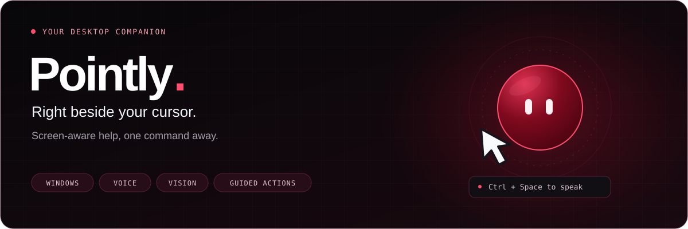

<p align="center">
  
</p>

<p align="center">
  <strong>A small companion for the things you do on your desktop.</strong><br />
  Ask by voice or text, understand what's on screen, and get help with the next step.
</p>

<p align="center">
  <a href="#what-pointly-does">Features</a> ·
  <a href="#how-it-works">How it works</a> ·
  <a href="#run-it-locally">Get started</a> ·
  <a href="#inside-the-repo">Explore the code</a>
</p>

## What Pointly does

| | Feature | In practice |
| :---: | :--- | :--- |
| ◉ | **Lives beside your cursor** | A crimson companion follows your pointer, with a click-through overlay outside typing mode. |
| ◌ | **Voice + text** | Speak a command, type in the floating capsule, or open the full chat dashboard. Sarvam handles transcription and spoken replies. |
| ◈ | **Screen understanding** | Ask “What do you see?” to send a screen capture to Gemini for visual analysis. |
| ↗ | **Everyday desktop actions** | Open websites, search in Chrome, control windows, and locate files on your Desktop. |
| ▤ | **Guided drafting** | Generate a draft, open Word, and follow visual steps to paste and format it. You complete the final steps. |
| ↺ | **Local history** | Revisit conversations and commands, with screen snapshots saved alongside companion interactions. |

**Try:** `Look at my screen` · `Open YouTube` · `Find report.pdf` · `Draft an email to my team`

## How it works

**Your command → transcription or text → action routing → a reply or guided steps.**

Electron runs the companion and dashboard. Supported desktop commands go to Windows helpers; questions and screen analysis go to **Gemini**. **Sarvam** provides speech-to-text and text-to-speech, while a local **Express** server handles provider requests. The companion shows responses and points to the next step in supported workflows.

## Run it locally

You need **Windows 10/11**, **Node.js with npm**, and your own **Gemini** and **Sarvam** API keys. Voice input needs a microphone; Chrome and Word workflows need those applications installed.

```powershell
git clone https://github.com/Aditya05h/Pointly.git
cd Pointly/Pointly-Main
npm install
```

Create `Pointly-Main/server/.env` with:

```dotenv
GEMINI_API_KEY=your_gemini_api_key
SARVAM_API_KEY=your_sarvam_api_key
```

Then, from `Pointly-Main`, run:

```powershell
npm run dev
```

The app starts its local server on port **8787** automatically. Keep your `.env` file private; it is already ignored by Git.

| Shortcut | Action |
| :--- | :--- |
| `Ctrl + Space` | Toggle voice input |
| `Ctrl + T` | Open the typing capsule |
| `Ctrl + Alt + Space` | Toggle the dashboard |
| `Ctrl + E` | End the voice session / stop playback |

<details>
<summary><strong>Web showcase &amp; Windows build</strong></summary>

The web portal includes a cursor demo, companion states, and workflow previews. From the repository root:

```powershell
cd Pointly-Web
npm run dev
```

Open **http://localhost:3000**. Google sign-in requires a configured Firebase project. The website's direct installer download is currently paused; use the desktop source setup above.

To package the desktop app, run `npm run build` inside `Pointly-Main`. Electron Builder writes the Windows build to `Pointly-Main/dist/`.

</details>

## Inside the repo

| Directory | Purpose |
| :--- | :--- |
| [Pointly-Main](Pointly-Main/) | Electron app, cursor overlay, chat, Windows helpers, and Express API server. |
| [Pointly-Web](Pointly-Web/) | HTML/CSS/JavaScript showcase with interactive demos and Firebase authentication. |

**Data handling:** AI features require internet access and send relevant prompts, audio, or screen captures to the configured providers. Interaction history and companion snapshots are stored in the app's local `pointly_memory` folder.

---

<p align="center"><sub>Pointly · Built by Team XOR · Electron / Node.js / Gemini / Sarvam</sub></p>
